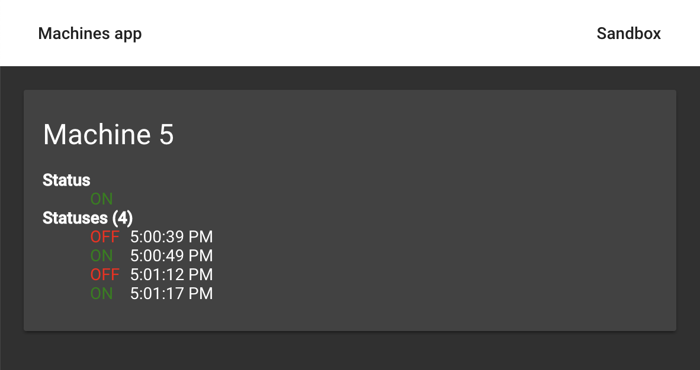

# CloudNC - Angular test

## Introduction

Hi :wave:,

Thanks for reaching out and welcome to CloudNC frontend test.

The final goal of this test is for you to build an Angular application.

The use of RxJS, Signals and Ngrx is a plus as we use these at CloudNC, but it's not a requirement.

## Scenario :bulb:

You've been tasked to build a frontend dashboard to monitor remote machines' task processing activity.

As each machine "comes online" it registers itself with a service which the frontend can access over http, and begins to post status updates (either `"ON"` or `"OFF"`) to the service which indicate the status of that machine processing a task.

This service exposes this machine info & stream of status updates to the frontend web client for display in a dashboard. This is where you come in!

**Your mission is to display the machines as they come online, their live
status, and upon "click" of that machine label, the live history of the status
updates from when the web app first connected to the service.**

The docker container we've provided simulates the service - it gives you
access to two things:

- One websocket which emits the status changes in real time of every machine
- One REST endpoint (`/machines/:machineId`) that returns for a given machine some basic information (just the `name` & `id`)

Listening to the websocket, you'll be able to discover the machines' task statuses changes over time, and for every new machine query the machine information from the REST endpoint.

The desired outcome is composed of 2 pages:

| **Main page: List of the machines**                   | **Second page: Information about a given machine**        |
| ----------------------------------------------------- | --------------------------------------------------------- |
|  |  |

_(do note that these screenshots are from an older version of the app and there's now a new theme but apart from that the intent is the same)._

## How to get started

### Backend

The backend is deployed into a Docker image that you'll need to run locally.
The service binds to port `3000` internally - once you're running the container the API will be available at http://localhost:3000 (the root route will say "Hello World" if all is working well).

The docker image is available here: https://hub.docker.com/r/cloudncfrontend/frontend-interview-backend

### Frontend

- Clone this repo (please don't fork so that other candidates can't easily discover your solution)
- Create a new private repo on your Github
- Remove the git remote and add your own repo as the main remote
- **Keep the original init commit we provide**, this is to help us review only the diff
- Open the frontend folder
- Run `yarn` to install the dependencies
- Run `yarn start` to get the app up and running on port 4200
- Go to http://localhost:4200/sandbox and make sure that the websocket is working fine (should display a json array after few seconds)

## Not expected from you

- Writing unit, integration or e2e tests if not explicitly asked (this is just in the interest of your time)
- Adding more features than the ones required
- A beautiful UI. Angular material is already set up, use it and that will be enough

## Expected from you

- Discover the existing code to avoid duplication
- Understand what you have to build, ask us questions if you have doubts
- Before jumping on the code, carefully think of a good architecture (state management)
- Write clean, reusable and optimized code. We prefer to have 50% of the final app with a good code instead of 100% with poor quality code!
- Write comments to explain your choices if needed. We believe that if you write quality code, it should be easily readable and need few comments, however do not hesitate to write some for non trivial things
- Regularly make commits, which might be helpful to understand the way you've built the app
- Feel free to use features/libraries that you're the most familiar with. You could use Signals, RxJS, Ngrx or anything else you'd like. Just make sure that you're comfortable with what you choose as we want to see you perform at your best. We rather prefer to see well organised, optimised and robust code built on top of older libraries/patterns rather than some code built with all the latest technologies that are not well understood

### Part 1

- The status should be either green or red in the UI (within `app-machine-status` component)
- Store all the events from the websocket.
  _Tip: Later, for a given machine, we will display all corresponding events with the status and the time of the change_.
  Feel free to use the sandbox component to display raw data in order to be sure you have the expected data
- Every time a new machine is discovered from the websocket because its status changes, retrieve the information of that machine (accessible with the REST endpoint `/machines:machineId`) and store it

### Part 2

**Prerequisites**: Make sure that you're on the URL `/machines`

- `MachinesComponent`: display all the machines saved
- `MachinesComponent`: display the current (latest) status of every machine
- `MachinesComponent`: Display into the `matBadge` the number of statuses for that machine

### Part 3

**Prerequisites**: Make sure that you've selected an existing machine from the list and
that the URL is `/machines/:machineId`

- Display in `Status` the current status of the machine
- Display in `Statuses` all the statuses of that machine

Finally, good luck, and don't hesitate to get in contact if you need a hand understanding the question.

## How to send your test

Once completed, please give access to `cloudnc-interview` to your **private** repo. We should receive an email straight away.
